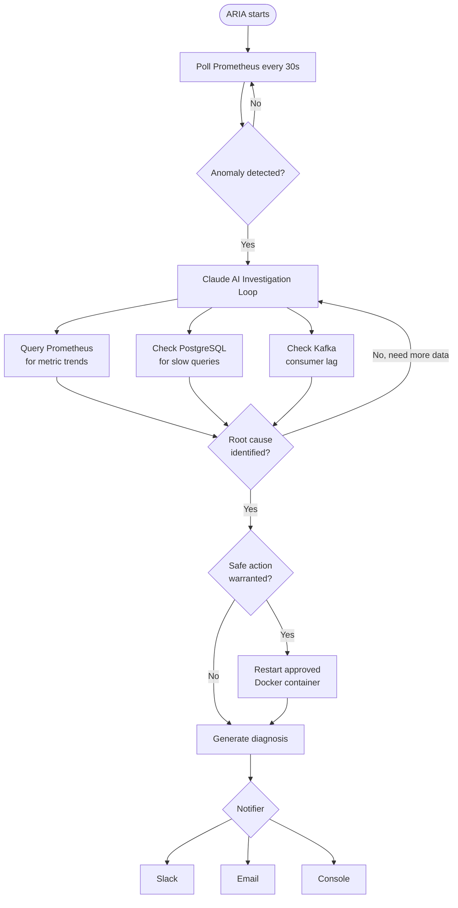
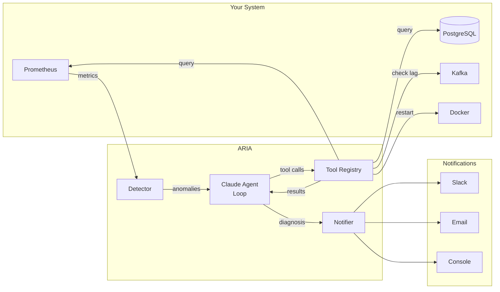
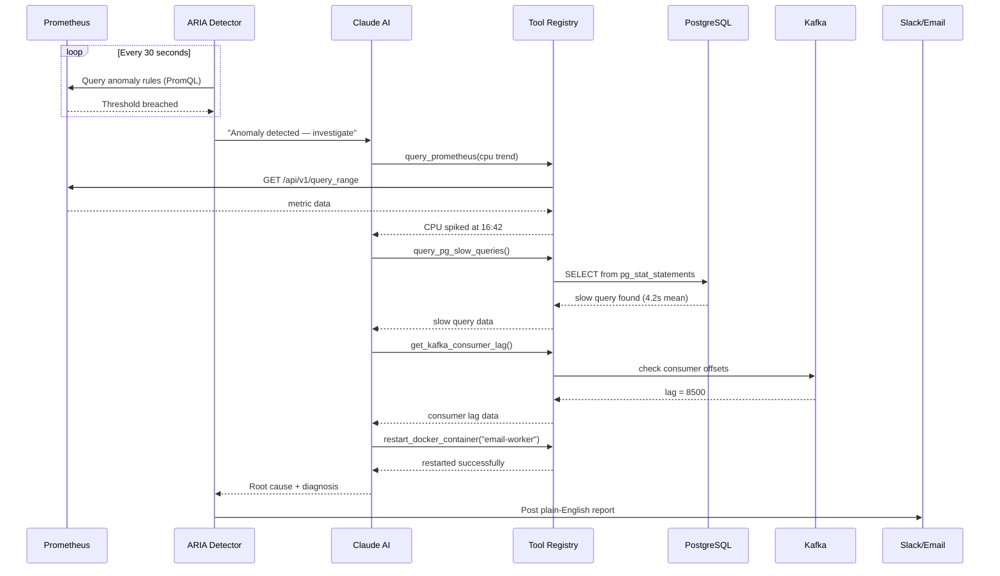

# ARIA — Autonomous Resilience & Incident Agent

> Detects anomalies, investigates with Claude AI, and self-heals distributed systems — so you don't get woken up at 2am.

---

## What is ARIA?

ARIA is an autonomous SRE (Site Reliability Engineering) agent. It watches your system's metrics, and when something goes wrong — instead of just firing an alert — it **thinks**.

It uses Claude AI to investigate the problem across multiple data sources, figure out the root cause, take one safe remediation action if appropriate, and send you a plain-English report.

```
Normal alert:    "CPU is at 90%" — you wake up, spend 45 mins investigating

ARIA:            "CPU spiked at 90% because a slow PostgreSQL query
                  (4.2s mean) caused the email consumer to stall,
                  building 8500 messages of Kafka lag and triggering
                  retries. I restarted the email worker. Add an index
                  on notifications(status) to prevent recurrence."
```

---

## How it works



---

## Architecture



---

## Sequence Diagram — Investigation Flow



---

## Features

- **Anomaly detection** — configurable PromQL rules, any metric Prometheus tracks
- **AI-powered investigation** — Claude reasons across metrics, database, and queue data
- **Safe autonomous action** — restarts containers from an approved whitelist only
- **Multi-notifier** — send reports to Slack, Email, or Console
- **Plug-and-play** — disable Kafka or PostgreSQL via config if your stack doesn't use them
- **Extensible** — add new tools, anomaly rules, or notifiers without touching core logic

---

## Prerequisites

- Python 3.11+
- [uv](https://github.com/astral-sh/uv) — Python package manager
- A running Prometheus instance (port 9090)
- An [Anthropic API key](https://console.anthropic.com/)
- Docker (optional — only needed for container restarts)

---

## Quick Start

**1. Clone the repo**
```bash
git clone https://github.com/dollykaur/aria.git
cd aria
```

**2. Install dependencies**
```bash
pip install uv
uv sync
```

**3. Set up your environment**
```bash
cp .env.example .env
```

Open `.env` and fill in your values:
```
ANTHROPIC_API_KEY=sk-ant-...
ARIA_NOTIFIER=console
ARIA_PG_PASSWORD=your_db_password
```

**4. Run ARIA**
```bash
uv run aria
```

ARIA will start polling Prometheus every 30 seconds and print any diagnoses to the console.

---

## Configuration

All settings live in two places:

| File | Purpose |
|---|---|
| `aria/config.yaml` | Non-sensitive settings — anomaly rules, thresholds, safe containers |
| `.env` | Secrets — API keys, passwords, webhook URLs |

Environment variables always override `config.yaml`.

---

### Choosing your notifier

Set `ARIA_NOTIFIER` in your `.env`:

```
ARIA_NOTIFIER=console   # print to terminal (default, good for development)
ARIA_NOTIFIER=slack     # post to Slack channel
ARIA_NOTIFIER=email     # send an email
```

**Slack setup**
```
ARIA_SLACK_WEBHOOK_URL=https://hooks.slack.com/services/...
```
Create a webhook at: Slack → Your App → Incoming Webhooks → Add New Webhook

**Email setup**
```
ARIA_SMTP_HOST=smtp.gmail.com
ARIA_SMTP_PORT=465
ARIA_EMAIL_SENDER=you@gmail.com
ARIA_EMAIL_PASSWORD=your-app-password
ARIA_EMAIL_RECIPIENT=oncall@yourteam.com
```
For Gmail: use an [App Password](https://myaccount.google.com/apppasswords), not your regular password.

---

### Adding anomaly rules

Edit `aria/config.yaml`. Each rule is a PromQL query that returns results **only when a threshold is breached**:

```yaml
prometheus:
  anomaly_rules:
    - name: "High CPU"
      query: '100 - (avg(rate(node_cpu_seconds_total{mode="idle"}[5m])) * 100) > 80'
      severity: "warning"

    - name: "High JVM Heap"
      query: 'jvm_memory_used_bytes{area="heap"} / jvm_memory_max_bytes{area="heap"} > 0.85'
      severity: "warning"

    - name: "High Error Rate"
      query: 'rate(http_server_requests_seconds_count{status=~"5.."}[5m]) > 0.05'
      severity: "critical"
```

**How rules work:**
- If the query returns **nothing** → all clear
- If the query returns **a result** → anomaly detected, investigation starts

No code changes needed — just edit the YAML and restart ARIA.

---

### Disabling components

If your stack doesn't use Kafka or PostgreSQL, disable them in `.env`:

```
ARIA_KAFKA_ENABLED=false
```

ARIA will skip those tools during investigation and Claude will work with whatever data is available.

---

### Safe container list

ARIA will **only** restart containers explicitly listed here. This is a hard code-level check — Claude cannot bypass it regardless of its reasoning.

```yaml
docker:
  safe_containers:
    - "notification-service"
    - "email-worker"
    - "sms-worker"
```

Leave this list empty if you don't want ARIA to restart anything autonomously.

---

## Running with Docker

Run ARIA alongside your existing stack:

```bash
cp .env.example .env   # fill in your values
docker-compose up -d
```

ARIA connects to your existing services via `network_mode: host`, so it can reach Prometheus, PostgreSQL, and Kafka on their usual ports.

---

## Project Structure

```
aria/
├── aria/
│   ├── main.py              # entry point — polling loop
│   ├── config.py            # config loading
│   ├── config.yaml          # anomaly rules + settings
│   ├── models.py            # data models (Anomaly, Diagnosis)
│   ├── agent/
│   │   ├── loop.py          # Claude tool-use reasoning loop
│   │   ├── tools.py         # tool definitions Claude reads
│   │   └── system_prompt.py # Claude's instructions
│   ├── tools/               # tool implementations
│   │   ├── prometheus.py    # query metrics
│   │   ├── postgres.py      # query slow queries
│   │   ├── kafka.py         # check consumer lag
│   │   └── docker_tool.py   # restart containers
│   ├── detectors/
│   │   └── prometheus.py    # anomaly detection
│   └── notifiers/
│       ├── slack.py         # Slack webhook
│       ├── email.py         # SMTP email
│       └── console.py       # terminal output
├── .env.example
├── docker-compose.yml
└── pyproject.toml
```

---

## Roadmap

| Version | What's planned |
|---|---|
| **v1 (current)** | Prometheus + PostgreSQL + Kafka + Docker |
| **v2** | Pluggable detectors — Datadog, CloudWatch, Zipkin |
| **v3** | Pluggable databases — MongoDB, Snowflake, MySQL |
| **v4** | Pluggable queues — RabbitMQ, SQS, no queue |
| **v5** | Kubernetes support, memory across incidents |

---

## Contributing

Contributions are welcome. ARIA is MIT licensed — use it, fork it, improve it.

Good places to start:
- Add a new notifier (Discord, PagerDuty, Microsoft Teams)
- Add a new anomaly rule for a common failure pattern
- Add support for a new monitoring tool, database, or message queue
- Improve the Claude system prompt for better root cause accuracy

Please open an issue before starting a large change so we can discuss the approach.

---

## License

MIT License — see [LICENSE](LICENSE) for details.

---

## Built with

- [Anthropic Claude](https://anthropic.com) — AI reasoning and tool use
- [Prometheus](https://prometheus.io) — metrics and anomaly detection
- [Apache Kafka](https://kafka.apache.org) — message queue monitoring
- [PostgreSQL](https://postgresql.org) — slow query analysis
- [Docker](https://docker.com) — container management
