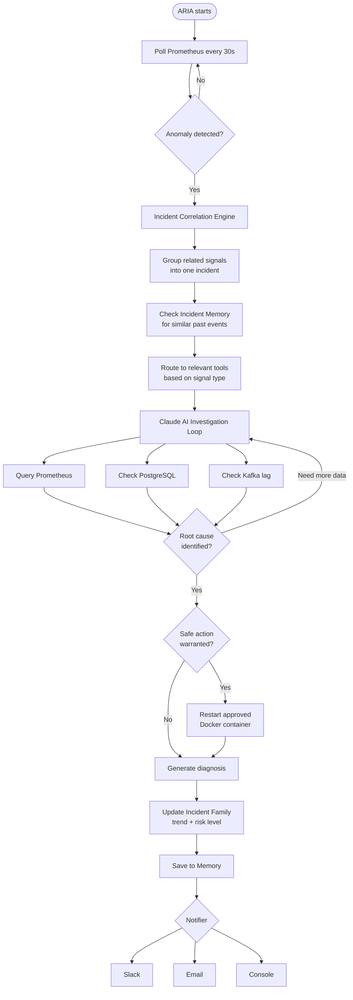
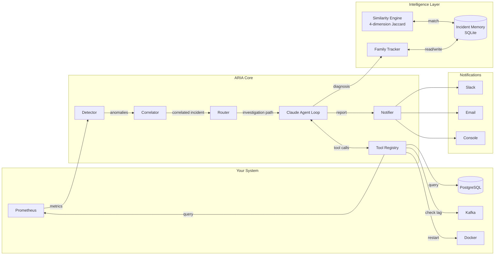

# ARIA — Autonomous Resilience & Incident Agent

> Detects anomalies, investigates with Claude AI, and self-heals distributed systems — so you don't get woken up at 2am.

---

## What is ARIA?

ARIA is an autonomous SRE agent. It watches your system's metrics, and when something goes wrong — instead of firing a dumb alert — it **thinks**.

It uses Claude AI to investigate the problem across multiple data sources, identify the root cause, take one safe remediation action if appropriate, and post a plain-English report.

```
Normal alert:  "CPU is at 90%" — you wake up, spend 45 mins investigating

ARIA:          "Fleet-wide GC burst detected across all 4 notification services
                (4th recurrence in 6 hours — WORSENING, Risk: HIGH).
                Root cause: scheduled batch dispatch in notification-api driving
                simultaneous G1 Young Gen evacuation pauses fleet-wide.
                email-worker accumulating Old Gen pressure (48 GC events, 8.5s
                cumulative pause — 2.2x peers). Escalate to platform engineer."
```

---

## How It Works



---

## Architecture



---

## Intelligence Features

### Incident Correlation Engine
Multiple alerts from the same root cause are grouped into one incident before Claude investigates. Four "High CPU Usage" signals across four services become one **Fleet-wide High CPU Usage** investigation — one Claude call, not four.

### Adaptive Tool Selection
ARIA classifies each anomaly by signal type and builds a focused investigation path before calling Claude:

| Signal type | Investigates first | Defers |
|---|---|---|
| JVM GC spike | GC pause rates, heap usage, Kafka lag | PostgreSQL, host CPU |
| Host CPU spike | process vs system CPU, JVM GC | Kafka, PostgreSQL |
| Kafka / DLQ | consumer lag, delivery failure rates | PostgreSQL, host CPU |
| DB connection pool | slow queries, HikariCP metrics | Kafka, JVM GC |
| HTTP 5xx errors | error rates, PostgreSQL, Kafka | — |

### Incident Memory
Every investigation is stored in SQLite and matched against future incidents using a **4-dimension Jaccard similarity model**:

| Dimension | Weight | What it measures |
|---|---|---|
| Anomaly type | 40% | Word-token Jaccard on rule names |
| Affected services | 25% | Set Jaccard on service names |
| Metric signals | 20% | Jaccard on raw PromQL metric identifiers |
| Time of day | 15% | Hour proximity — catches scheduled-job patterns |

At **≥ 85% similarity**, Claude receives a structured "known pattern" block and confirms quickly instead of re-investigating from scratch.

### Incident Family Tracking
Related incidents are grouped into families named after their **root cause class**, not the metric:

```
Incident Family : Notification Batch Dispatch GC
First Seen      : 2026-06-19 22:59
Last Seen       : 2026-06-20 05:23
Occurrences     : 4
Trend           : WORSENING | +161% metric
Risk Level      : HIGH
```

Risk escalates automatically: `warning → elevated → high → critical` when trend is worsening or occurrence count reaches 4+.

### Human Feedback Loop
```bash
aria-feedback <incident_id> correct
aria-feedback <incident_id> incorrect "database lock contention, not batch job"
aria-stats
```

```
ARIA Diagnosis Accuracy
========================================
Diagnoses reviewed : 12
  Correct          : 10  (83.3%)
  Incorrect        : 2

Incident Families
========================================
  Notification Batch Dispatch GC   4 occurrences  WORSENING  Risk: HIGH
  Notification Kafka Consumer Lag  2 occurrences  STABLE     Risk: WARNING
```

### Safety Guardrails
- **Container whitelist** — ARIA only restarts containers explicitly listed in `config.yaml`. Hard code-level check, Claude cannot bypass it.
- **No infrastructure tuning** — Claude flags JVM, kernel, and database tuning opportunities but never suggests specific values. Defers to platform engineers.
- **One action per investigation** — Claude may take at most one remediation action per run.

---

## Quick Start

**1. Clone the repo**
```bash
git clone https://github.com/dollykaur/aria.git
cd aria
```

**2. Install dependencies**
```bash
pip install uv
uv sync
```

**3. Set up your environment**
```bash
cp .env.example .env
```

Open `.env` and fill in:
```
ANTHROPIC_API_KEY=sk-ant-...
ARIA_NOTIFIER=console
ARIA_PG_PASSWORD=your_db_password
```

**4. Run ARIA**
```bash
uv run aria
```

ARIA polls Prometheus every 30 seconds and prints diagnoses to the console.

---

## Configuration

| File | Purpose |
|---|---|
| `aria/config.yaml` | Non-sensitive settings — anomaly rules, thresholds, safe containers |
| `.env` | Secrets — API keys, passwords, webhook URLs |

Environment variables always override `config.yaml`.

### Notifier

```
ARIA_NOTIFIER=console   # terminal (default)
ARIA_NOTIFIER=slack     # Slack channel
ARIA_NOTIFIER=email     # SMTP email
```

**Slack:** `ARIA_SLACK_WEBHOOK_URL=https://hooks.slack.com/services/...`

**Email:**
```
ARIA_SMTP_HOST=smtp.gmail.com
ARIA_SMTP_PORT=465
ARIA_EMAIL_SENDER=you@gmail.com
ARIA_EMAIL_PASSWORD=your-app-password
ARIA_EMAIL_RECIPIENT=oncall@yourteam.com
```

### Anomaly Rules

Each rule is a PromQL expression that returns results **only when a threshold is breached**:

```yaml
prometheus:
  anomaly_rules:
    - name: "High CPU Usage"
      query: 'system_cpu_usage > 0.50'
      severity: "warning"

    - name: "High JVM Heap"
      query: 'jvm_memory_used_bytes{area="heap"} / jvm_memory_max_bytes{area="heap"} > 0.85'
      severity: "warning"

    - name: "HTTP 5xx Error Rate"
      query: 'rate(http_server_requests_seconds_count{status=~"5.."}[5m]) > 0.05'
      severity: "critical"
```

No code changes needed — edit the YAML and restart ARIA.

### Safe Container List

```yaml
docker:
  safe_containers:
    - "notification-service"
    - "email-worker"
    - "sms-worker"
```

Leave empty to disable autonomous restarts entirely.

---

## Project Structure

```
aria/
├── aria/
│   ├── main.py                  # entry point — polling loop
│   ├── config.py                # config loading (env + yaml)
│   ├── config.yaml              # anomaly rules + settings
│   ├── models.py                # Anomaly, Diagnosis, CorrelatedIncident
│   ├── correlator.py            # fleet-wide incident grouping
│   ├── cli.py                   # aria-feedback, aria-stats commands
│   ├── agent/
│   │   ├── loop.py              # Claude tool-use reasoning loop
│   │   ├── router.py            # adaptive tool selection
│   │   ├── tools.py             # tool definitions Claude reads
│   │   └── system_prompt.py     # Claude's instructions + guardrails
│   ├── tools/
│   │   ├── base.py              # ToolResult, ToolRegistry
│   │   ├── prometheus.py        # query metrics
│   │   ├── postgres.py          # slow query analysis
│   │   ├── kafka.py             # consumer lag
│   │   └── docker_tool.py       # container restarts
│   ├── detectors/
│   │   └── prometheus.py        # anomaly detection
│   ├── memory/
│   │   ├── store.py             # SQLite CRUD, family upsert, feedback
│   │   ├── matcher.py           # 4-dimension similarity scoring
│   │   └── family.py            # trend, risk, name generation logic
│   └── notifiers/
│       ├── factory.py           # notifier selection
│       ├── slack.py
│       ├── email.py
│       └── console.py
├── .env.example
├── docker-compose.yml
└── pyproject.toml
```

---

## Roadmap

| Version | Status | What |
|---|---|---|
| **v1** | ✅ Done | Prometheus detection, Claude loop, Kafka + PostgreSQL + Docker tools, multi-notifier |
| **v2** | ✅ Done | Incident Memory, Correlation Engine, Family Tracking, Adaptive Tool Selection, Human Feedback |
| **v3** | Planned | Multi-agent system — Triage → Investigation → Remediation → Verifier agents |
| **v4** | Planned | Pluggable detectors — Datadog, CloudWatch, Zipkin |
| **v5** | Planned | Kubernetes support, RabbitMQ, SQS |

---

## Contributing

MIT licensed — use it, fork it, improve it.

Good places to start:
- Add a new notifier (Discord, PagerDuty, Microsoft Teams)
- Add a new anomaly rule for a common failure pattern
- Add support for a new monitoring tool, database, or message queue
- Extend the router with new signal classes

Please open an issue before starting a large change.

---

## License

MIT — see [LICENSE](LICENSE) for details.

---

## Built with

- [Anthropic Claude](https://anthropic.com) — AI reasoning and tool use
- [Prometheus](https://prometheus.io) — metrics and anomaly detection
- [Apache Kafka](https://kafka.apache.org) — message queue monitoring
- [PostgreSQL](https://postgresql.org) — slow query analysis
- [Docker](https://docker.com) — container management
